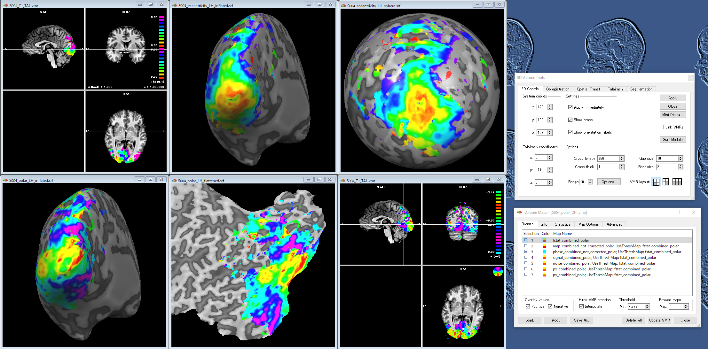
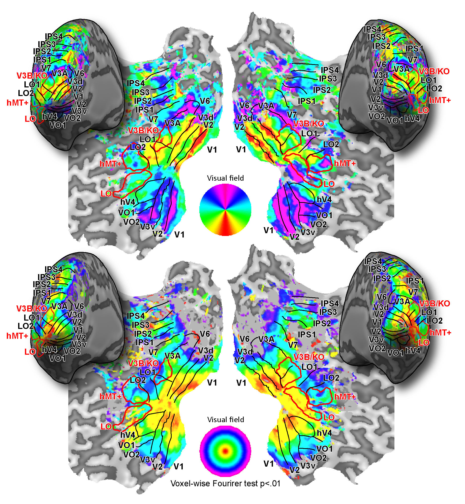

# **README on Retinotopy**

<div>Created    : "2013-11-25 10:25:05 ban"</div>
<div>Last Update: "2021-11-17 05:28:24 ban"

***

# <a name = "Menu"> **Menu** </a>

- [Introduction – what is Retinotopy ?](#Introduction)
- [System requirements](#System)
- [How to run Retinotopy](#Launch)
  - [Detailed descriptions of the Retinotopy](#Details)
  - [About the displayfile](#Displayfile)
  - [About the stimulusfile](#Stimulusfile)
- [Acknowledgments](#Acknowledgments)
- [License](#License)
- [Citation](#Citation)
- [TODOs](#TODOs)

***

# <a name = "Introduction"> **Introduction – what is Retinotopy ?** </a>

  

*The Retinotopy is an all-in-one package of the visual stimuli for the retinotopic mapping.*  

 

*The fMRI responses evoked by the Retinotopy stimuli can be analyzed with BrainVoyager or the other tools.*  

  

*The retinotopic mapping results on the author's cortices.*  
<br></br>
Retinotopy is a ***MATLAB***-based all-in-one software package for presenting/controlling so-called "retinotopy stimuli", which includes, as some instances, the conventional counter-clockwise/clockwise rotating wedges, expanding/contracting annuli, sweeping bars, and multifocal patterns, consisting of checkerboards, random-dot-stereograms, and object images. By measuring fMRI/MEG responses while particpants are viewing these stimuli, we can get cortical retinotopy representations. The obtained representation can be used for delineating the borders of retinotopic visual areas such as V1, V2, and V3.  

(Matlab is a registered trademark of [***The Mathworks Inc.*** ](https://www.mathworks.com/) )  

While many of the similar lines of stimulus codes are already publicly available, compared to them, the advantages of this package are  

  ***1. Many types of the retinototpy stimuli as well as conventional wedges and annuli are implemented. The users can access these stimuli through one simple wrapper function.***  

  ***2. As I have been doing binocular/stereo vision studies with fMRI/MEG, I often have to present the stimuli with binocular viewing setups, such as stereo-shutter-goggles and polarized glasses, on the dual display systems. This Retinotopy package can handle such situations and is fully compatible with the dual-display as well as single-display configurations.***  

For more details, please read the descriptions below.  
Also please check the header comments in ~/Retinotopy/Presentation/retinotopy.m.  

Thank you for using my software package.  
I am happy if Retinotopy can help your research projects.  

[back to the menu](#Menu)

# <a name = "System"> **System requirements** </a>

- **OS: Windows 7/8/10, Mac OSX, or Linux**
  - note: Some parts of the codes (e.g. sound(beep)-related part) may be required to be modified if you are going to run the stimuli on a Linux box.

- **MATLAB R2009a** or later (We have tested the latest version with **R2020b** and **R2017a**), **Psychtoolbox** (for details, please see the [Acknowledgments](#Acknowledgments) section), and **Image Processing** toolbox.  
  - note 1: Some of the retinotopy stimuli would work even without image_processing toolbox, but to use full functionality of the software, the toolbox is required.  
  - note 2: Psychtoolbox 3.0.15 or above is required. We have not tested the compatibility of Retinotopy with the former versions of PTB3 and PTB2.  

- **Graphics board**  
  - OpenGL-compatible graphics board is preferred rather than using built-in CPU graphics function.

[back to the menu](#Menu)

# <a name = "Launch"> **How to run Retinotopy** </a>

***Running the wrapper function, retinotopy***  
To run Retinotopy on MATLAB, please follow the commands below.  

```Matlab
>> cd ~/Retinotopy/Presentation
>> retinotopy('name','stimulus_type',acquisition_number);
```

Here, the function, ***retinotopy***, is a simple wrapper to control phase-encoded/pRF retinotopy stimuli with participant-specific stimulus configuration parameters stored in ~/StereoScreening/Presentation/subjects/'name' directory. The input variable, 'name' should be a string that specifies the name (or ID) of the participant, 'stimulus_type' (e.g. ccw) is one of the stimulus types (for details, please see the list below), and acquisition_number should be an integer, such as 1, 2, 3,...  
The fMRI responses evoked by the stimuli can be used to delineate borders of retinotopic visual areas.  


# <a name = "Details"> **Detailed descriptions of retinotopy.m** </a>

````Matlab
function OK=retinotopy(subj,exp_mode,acq_num,:overwrite_pix_per_deg,:TR)
(: is optional)
````

***About***  
ALL-IN-ONE Retinotopy: a simple wrapper to control all the retinotopy stimulus scripts included in this "Retinotopy" package. The script should be used with MATLAB Psychtoolbox version 3 or above.

***Examples***
````Matlab
(after moving to ~/Retinotopy/presentation directory)
>> retinotopy('HB','ccw',1);
>> retinotopy('HB',{'ccw','exp','ccw','exp'},[1,1,2,2]);
>> retinotopy('HB',{'ccwwindows','cwwindows','expwindows','contwindows'},[1,1,1,1]);
````

The details of the wrapped functions are as below.
<pre>
01. cretinotopy           : color/luminance-defined checkerboard stimuli with a checker-pattern luminance change detection task, for phase-encoded analysis
02. cretinotopy_fixtask   : color/luminance-defined checkerboard stimuli with a fixation luminance change detection task, for phase-encoded analysis
03. cbar                  : color/luminance-defined checkerboard bar stimuli with a checker-pattern luminance change detection task, for pRF analysis
04. cbar_fixtask          : color/luminance-defined checkerboard bar stimuli with a fixation luminance change detection task, for pRF analysis
05. cdual                 : color/luminance-defined checkerboard stimuli (polar wedge + eccentricity annulus) with a checker-pattern luminance change detection task, for phase-encoded/pRF analysis
06. cdual_fixtask         : color/luminance-defined checkerboard stimuli (polar wedge + eccentricity annulus) with a fixation luminance change detection task, for phase-encoded/pRF analysis
07. cmultifocal           : color/luminance-defined multifocal retinotopy checkerboard stimuli with a checker-pattern luminance change detection task, for GLM or pRF analysis
08. cmultifocal_fixtask   : color/luminance-defined multifocal retinotopy checkerboard stimuli with a fixation luminance change detection task, for GLM or pRF analysis
09. cmeridian             : color/luminance-defined dual wedge checkerboards presented along the horizontal or vertical visual meridian with a checker-pattern luminance change detection task
10. cmeridian_fixtask     : color/luminance-defined dual wedge checkerboards presented along the horizontal or vertical visual meridian with a fixation luminance change change detection task
11. chrf                  : color/luminance-defined checkerboard stimuli with a checker-pattern luminance change detection task, for HRF shape estimation
12. chrf_fixtask          : color/luminance-defined checkerboard stimuli with a fixation luminance change detection task, for HRF shape estimation
13. clgnlocalizer         : color/luminance-defined checkerboard stimuli with a checker-pattern luminance change detection task, for localizing LGN
14. clgnlocalizer_fixtask : color/luminance-defined checkerboard stimuli with a fixation luminance change detection task, for localizing LGN
15. clocalizer            : color/luminance-defined checkerboard stimuli with a checker-pattern luminance change detection task, for identifying retinotopic iso-eccentricity subregions
16. clocalizer_fixtask    : color/luminance-defined checkerboard stimuli with a fixation luminance change detection task, for identifying retinotopic iso-eccentricity subregions
17. iretinotopy_fixtask   : object-image-defined retinotopy stimuli with a fixation luminance change detection task, for phase-encoded analysis
18. ibar_fixtask          : object-image-defined bar stimuli with a fixation luminance change detection task, for pRF analysis
19. idual_fixtask         : object-image-defined dual stimuli (polar wedge + eccentricity annulus) with a fixation luminance change detection task, for phase-encoded/pRF analysis
20. imultifocal_fixtask   : object-image-defined multifocal retinotopy stimuli with a fixation luminance change detection task, for GLM or pRF analysis
21. imeridian_fixtask     : object-image-defined dual wedge stimuli presented along the horizontal or vertical visual meridian with a fixation luminance change change detection task
22. ihrf_fixtask          : object-image-defined wedge stimuli with a fixation luminance change detection task, for HRF shape estimation
23. ilgnlocalizer_fixtask : object-image-defined wedge stimuli with a fixation luminance change detection task, for localizing LGN
24. ilocalizer_fixtask    : object-image-defined stimuli with a fixation luminance change detection task, for identifying retinotopic iso-eccentricity subregions
25. dretinotopy           : disparity(depth, Random-Dot-Stereogram (RDS))-defined retinotopy stimuli with a checker-pattern depth change detection task, for phase-encoded analysis
26. dretinotopy_fixtask   : disparity(depth, Random-Dot-Stereogram (RDS))-defined retinotopy stimuli with a fixation luminance change detection task, for phase-encoded analysis
27. dbar                  : disparity(depth, Random-Dot-Stereogram (RDS))-defined bar stimuli with a checker-pattern depth change detection task, for pRF analysis
28. dbar_fixtask          : disparity(depth, Random-Dot-Stereogram (RDS))-defined bar stimuli with a fixation luminance change detection task, for pRF analysis
29. ddual                 : disparity(depth, Random-Dot-Stereogram (RDS))-defined dual stimuli (polar wedge + eccentricity annulus) with a checker-pattern depth change detection task, for phase-encoded/pRF analysis
30. ddual_fixtask         : disparity(depth, Random-Dot-Stereogram (RDS))-defined dual stimuli (polar wedge + eccentricity annulus) with a fixation luminance change detection task, for phase-encoded/pRF analysis
31. dmultifocal           : disparity(depth, Random-Dot-Stereogram (RDS))-defined multifocal retinotopy stimuli with a checker-pattern depth change detection task, for GLM or pRF analysis
32. dmultifocal_fixtask   : disparity(depth, Random-Dot-Stereogram (RDS))-defined multifocal retinotopy stimuli with a fixation luminance change detection task, for GLM or pRF analysis
33. dmeridian             : disparity(depth, Random-Dot-Stereogram (RDS))-defined dual wedge stimuli presented along the horizontal or vertical visual meridian with a checker-pattern depth change detection task
34. dmeridian_fixtask     : disparity(depth, Random-Dot-Stereogram (RDS))-defined dual wedge stimuli presented along the horizontal or vertical visual meridian with a fixation luminance change change detection task
35. dhrf                  : disparity(depth, Random-Dot-Stereogram (RDS))-defined wedge stimuli with a checker-pattern depth change detection task, for HRF shape estimation
36. dhrf_fixtask          : disparity(depth, Random-Dot-Stereogram (RDS))-defined wedge stimuli with a fixation luminance change detection task, for HRF shape estimation
37. dlgnlocalizer         : disparity(depth, Random-Dot-Stereogram (RDS))-defined wedge stimuli with a checker-pattern depth change detection task, for localizing LGN
38. dlgnlocalizer_fixtask : disparity(depth, Random-Dot-Stereogram (RDS))-defined wedge stimuli with a fixation luminance change detection task, for localizing LGN
39. dlocalizer            : disparity(depth, Random-Dot-Stereogram (RDS))-defined stimuli with a checker-pattern depth change detection task, for identifying retinotopic iso-eccentricity subregions
40. dlocalizer_fixtask    : disparity(depth, Random-Dot-Stereogram (RDS))-defined stimuli with a fixation luminance change detection task, for identifying retinotopic iso-eccentricity subregions
41. gen_retinotopy_windows: a function for generating checkerboard stimulus windows of ccw/cw/exp/cont, for phase-encoded/pRF analysis
42. gen_bar_windows       : a function for generating standard pRF bar stimulus windows, for pRF analysis
43. gen_dual_windows      : a function for generating checkerboard (wedge + annulus) stimulus windows, for phase-encoded/pRF analysis
44. gen_multifocal_windows: a function for generating multifocal retinoopy checkerboard stimulus windows, for pRF analysis

For more details, please see each function's header help document.
</pre>

***Input/output variables of StereoScreening.m***  

[Input variables]  
<pre>
subj_name: subject name, e.g. 'HB'
           the directory named as subj_name (e.g. 'HB') should be located in ~/retinotopy/Presentation/subjects/
           under which configurations files are included. By changing parameters in the configuration files,
           stimulus type, size, colors, moving speed, presentation timing etc can be manipulated as you like.
           For details, please see the files in ~/retinotopy/Presentation/subjects/_DEFAULT_.
           If subject directory does not exist in the specific directory described above, the parameters in the
           _DEFAULT_ directory would be automatically copied as subj_name and the default parameters are used for
           stimulus presentation. you can modify the default parameters later once the files are copied and the
           script is terminated.

exp_mode: experiment mode (= stimulus type) that you want to run, one of

          *** the attention-on-the-target stimuli. task -- luminance change detection of one of the patches on the checkerboard ***
          - ccw     : color/luminance-defined checkerboard wedge rotating counter-clockwisely
          - cw      : color/luminance-defined checkerboard wedge rotating clockwisely
          - exp     : color/luminance-defined checkerboard annulus expanding from fovea to periphery
          - cont    : color/luminance-defined checkerboard annulus contracting from periphery to fovea
          - bar     : color/luminance-defined checkerboard bar, a standard pRF (population receptive field) stimulus
          - ccwexp  : color/luminance-defined checkerboard wedge + annulus, a standard phase-encoded/pRF (population receptive field) stimulus
          - ccwcont : color/luminance-defined checkerboard wedge + annulus, a standard phase-encoded/pRF (population receptive field) stimulus
          - cwexp   : color/luminance-defined checkerboard wedge + annulus, a standard phase-encoded/pRF (population receptive field) stimulus
          - cwcont  : color/luminance-defined checkerboard wedge + annulus, a standard phase-encoded/pRF (population receptive field) stimulus
          - multifocal : color/luminance-defined checkerboard, a standard multifocal retinotopy stimulus
          - meridian : color/luminance-defined dual wedge checkerboards presented along the horizontal or vertical visual meridian
          - lgn     : color/luminance-defined hemifield checkerboard patterns, to localize LGN
          - hrf     : color/luminance-defined checkerboard pattern, to evaluate HRF responses by default
          - localizer : color/luminance-defined checkerboard patterns, to identify specific iso-eccentricity regions

          *** the standard stimuli for naive participants to fixate the center of the screen more. task -- luminance change detection on the central "f"ixation point ***
          - ccwf    : color/luminance-defined checkerboard wedge rotating counter-clockwisely
          - cwf     : color/luminance-defined checkerboard wedge rotating clockwisely
          - expf    : color/luminance-defined checkerboard annulus expanding from fovea to periphery
          - contf   : color/luminance-defined checkerboard annulus contracting from periphery to fovea
          - barf    : color/luminance-defined checkerboard bar, a standard pRF (population receptive field) stimulus
          - ccwexpf : color/luminance-defined checkerboard wedge + annulus, a standard phase-encoded/pRF (population receptive field) stimulus
          - ccwcontf: color/luminance-defined checkerboard wedge + annulus, a standard phase-encoded/pRF (population receptive field) stimulus
          - cwexpf  : color/luminance-defined checkerboard wedge + annulus, a standard phase-encoded/pRF (population receptive field) stimulus
          - cwcontf : color/luminance-defined checkerboard wedge + annulus, a standard phase-encoded/pRF (population receptive field) stimulus
          - multifocalf : color/luminance-defined checkerboard, a standard multifocal retinotopy stimulus
          - meridianf : color/luminance-defined dual wedge checkerboards presented along the horizontal or vertical visual meridian
          - lgnf    : color/luminance-defined hemifield checkerboard patterns, to localize LGN
          - hrff    : color/luminance-defined checkerboard pattern, to evaluate HRF responses
          - localizerf : color/luminance-defined checkerboard patterns, to identify specific iso-eccentricity regions

          *** the "d"isparity stimuli. task -- depth change detection of one of the patches on the checkerboard ***
          - ccwd    : disparity(depth, Random-Dot-Stereogram (RDS))-defined wedge rotating counter-clockwisely
          - cwd     : disparity(depth, Random-Dot-Stereogram (RDS))-defined wedge rotating clockwisely
          - expd    : disparity(depth, Random-Dot-Stereogram (RDS))-defined annulus expanding from fovea to periphery
          - contd   : disparity(depth, Random-Dot-Stereogram (RDS))-defined annulus contracting from periphery to fovea
          - bard    : disparity(depth, Random-Dot-Stereogram (RDS))-defined bar, a standard pRF (population receptive field) stimulus
          - ccwexpd : disparity(depth, Random-Dot-Stereogram (RDS))-defined wedge + annulus, a standard phase-encoded/pRF (population receptive field) stimulus
          - ccwcontd  : disparity(depth, Random-Dot-Stereogram (RDS))-defined wedge + annulus, a standard phase-encoded/pRF (population receptive field) stimulus
          - cwexpd  : disparity(depth, Random-Dot-Stereogram (RDS))-defined wedge + annulus, a standard phase-encoded/pRF (population receptive field) stimulus
          - cwcontd : disparity(depth, Random-Dot-Stereogram (RDS))-defined wedge + annulus, a standard phase-encoded/pRF (population receptive field) stimulus
          - multifocald  : disparity(depth, Random-Dot-Stereogram (RDS))-defined multifocal retinotopy stimulus
          - meridiand  : disparity(depth, Random-Dot-Stereogram (RDS))-defined dual wedges presented along the horizontal or vertical visual meridian
          - lgnd    : disparity(depth, Random-Dot-Stereogram (RDS))-defined hemifield wedge patterns, to localize LGN
          - hrfd    : disparity(depth, Random-Dot-Stereogram (RDS))-defined pattern, to evaluate HRF responses
          - localizerd : disparity(depth, Random-Dot-Stereogram (RDS))-defined iso-eccentricity stimulation patterns, to identify specific iso-eccentricity regions

          *** the "d"isparity stimuli for naive partidcipants. task -- luminance change detection on the central "f"ixation point ***
          - ccwdf   : disparity(depth, Random-Dot-Stereogram (RDS))-defined wedge rotating counter-clockwisely
          - cwdf    : disparity(depth, Random-Dot-Stereogram (RDS))-defined wedge rotating clockwisely
          - expdf   : disparity(depth, Random-Dot-Stereogram (RDS))-defined annulus expanding from fovea to periphery
          - contdf  : disparity(depth, Random-Dot-Stereogram (RDS))-defined annulus contracting from periphery to fovea
          - bardf   : disparity(depth, Random-Dot-Stereogram (RDS))-defined bar, a standard pRF (population receptive field) stimulus
          - ccwexpdf: disparity(depth, Random-Dot-Stereogram (RDS))-defined wedge + annulus, a standard phase-encoded/pRF (population receptive field) stimulus
          - ccwcontdf : disparity(depth, Random-Dot-Stereogram (RDS))-defined wedge + annulus, a standard phase-encoded/pRF (population receptive field) stimulus
          - cwexpdf : disparity(depth, Random-Dot-Stereogram (RDS))-defined wedge + annulus, a standard phase-encoded/pRF (population receptive field) stimulus
          - cwcontdf: disparity(depth, Random-Dot-Stereogram (RDS))-defined wedge + annulus, a standard phase-encoded/pRF (population receptive field) stimulus
          - multifocaldf : disparity(depth, Random-Dot-Stereogram (RDS))-defined multifocal retinotopy stimulus
          - meridiandf : disparity(depth, Random-Dot-Stereogram (RDS))-defined dual wedges presented along the horizontal or vertical visual meridian
          - lgndf   : disparity(depth, Random-Dot-Stereogram (RDS))-defined hemifield wedge patterns, to localize LGN
          - hrfdf   : disparity(depth, Random-Dot-Stereogram (RDS))-defined pattern, to evaluate HRF responses
          - localizerdf: disparity(depth, Random-Dot-Stereogram (RDS))-defined iso-eccentricity stimulation patterns, to identify specific iso-eccentricity regions

          *** object-image stimuli on the pink-noise background for stimulating ventral regions more. task -- luminance change detection on the central "f"ixation point ***
          - ccwi    : Object-image-defined wedge rotating counter-clockwisely
          - cwi     : Object-image-defined wedge rotating clockwisely
          - expi    : Object-image-defined annulus expanding from fovea to periphery
          - conti   : Object-image-defined annulus contracting from periphery to fovea
          - bari    : Object-image-defined bar, a standard pRF (population receptive field) stimulus
          - ccwexpi : Object-image-defined wedge + annulus, a standard phase-encoded/pRF (population receptive field) stimulus
          - ccwconti: Object-image-defined wedge + annulus, a standard phase-encoded/pRF (population receptive field) stimulus
          - cwexpi  : Object-image-defined wedge + annulus, a standard phase-encoded/pRF (population receptive field) stimulus
          - cwconti : Object-image-defined wedge + annulus, a standard phase-encoded/pRF (population receptive field) stimulus
          - multifocali : Object-image-defined multifocal retinotopy stimulus
          - meridiani : Object-image-defined dual wedges presented along the horizontal or vertical visual meridian
          - lgni    : Object-image-defined hemifield wedge patterns, to localize LGN
          - hrfi    : Object-image-defined pattern, to evaluate HRF responses
          - localizeri: Object-image-defined iso-eccentricity stimulation patterns, to identify specific iso-eccentricity regions

          *** these options are to make stimulus windows for pRF (population receptive field) model analysis ***
          - ccwwindows     : stimulation windows of wedge rotating counter-clockwisely
          - cwwindows      : stimulation windows of wedge rotating clockwisely
          - expwindows     : stimulation windows of annulus expanding from fovea
          - contwindows    : stimulation windows of annulus contracting from periphery
          - barwindows     : stimulation windows of a standard pRF bar
          - ccwexpwindows  : stimulation windows of a wedge+annulus checkerboard pattern
          - ccwcontwindows : stimulation windows of a wedge+annulus checkerboard pattern
          - cwexpwindows   : stimulation windows of a wedge+annulus checkerboard pattern
          - cwcontwindows  : stimulation windows of a wedge+annulus checkerboard pattern
          - multifocalwindows : stimulation windows of a standard multifocal retinotopy stimulus

          a string or a cell string structure, e.g. 'ccw', or {'ccw','exp'}.
          length(exp_mode) should equal numel(acq_num).

acq_num : acquisition number, 1,2,3,...

=========================================================================================
NOTE: the two input variables below are only effective when exp_mode is set to '*windows'
(one of stimulus window generation functions for pRF)
=========================================================================================

overwrite_pix_per_deg : (optional) pixels-per-deg value to overwrite the sparam.pix_per_deg
          if not specified, sparam.pix_per_deg is used to reconstruct
          stim_windows.
          This is useful to reconstruct stim_windows with less memory space
          1/pix_per_deg = spatial resolution of the generated visual field,
          e.g. when pix_per_deg=20, then, 1 pixel = 0.05 deg.
          empty (use sparam.pix_per_deg) by default

TR      : (optional) TR used in fMRI scans, in sec, 2 by default
</pre>

***IMPORTANT NOTE:***  
The displayfile & stimulusfile described above should be located at ~/Retinotopy/Presentation/subjects/(ID)/, like  
~/Retinotopy/Presentation/subjects/(ID)/retinotopy_display.m  
~/Retinotopy/Presentation/subjects/(ID)/pol.m  
~/Retinotopy/Presentation/subjects/(ID)/ecc.m  

To customize the stimulus presentation/controlling parameters, please change the contents of these files per participant following the detailed instructions described below. Or you can change the default parameters by modifying the contents of ~/Retinotopy/subjects/(ID) depending on your purpose.  

[Output variables]  
OK      : (optional) flag, whether this script finished without any error [true/false]  

[Result file]  
All the results, including participant responses, performance, stimulus parameters etc will be stored in  
~/Retinotopy/subjects/(ID)/results/(today)  
like ./subjects/(ID)/results/(today)/(ID)_cretinotopy_ccw_results_run_(run_num).log and  
./subjects/(ID)/results/(today)/(ID)_cretinotopy_ccw_results_run_(run_num).mat  

[back to the menu](#Menu)

# <a name = "Displayfile"> **About the displayfile** </a>

An example of the displayfile is as below.  

[displayfile.m](doc/markdowns/displayfile.md)  

[back to the menu](#Menu)

# <a name = "Stimulusfile"> **About the stimulusfile** </a>

Examples of the stimulusfile are as below.  
Each of the stimulusfiles are prepared for controlling the specific types of the stimuli. Please see each of the parts for more details.  

- stimulusfile type 1: **c_pol.m**  
This file is used for controlling the **ccw/cw/ccwf/cwf/ccwd/cwd/ccwi/cwi/ccwdf/cwdf/ccwwindows/cwsindows** stimuli  
[c_pol.m](doc/markdowns/c_pol.md)  

- stimulusfile type 2: **c_ecc.m**  
This file is used for controlling the **exp/cont/expf/contf/expd/contd/expi/conti/expdf/contdf/expwindows/contsindows** stimuli  
[c_ecc.m](doc/markdowns/c_ecc.md)  

- stimulusfile type 3: **c_bar.m**  
This file is used for controlling the **bar/bard/barf/bari/bardf/barwindows** stimuli  
[c_bar.m](doc/markdowns/c_bar.md)  

- stimulusfile type 4: **c_meridian.m**  
This file is used for controlling the **meridian/meridiand/meridianf/meridiani/meridiandf** stimuli  
[c_meridian.m](doc/markdowns/c_meridian.md)  

- stimulusfile type 5: **c_hrf.m**  
This file is used for controlling the **hrf/hrfd/hrff/hrfi/hrfdf** stimuli  
[c_hrf.m](doc/markdowns/c_hrf.md)  

- stimulusfile type 6: **c_dual.m**  
This file is used for controlling the **ccwexp/cwexp/ccwcont/cwcont/ccwexpd/cwexpd/**  
**ccwcontd/cwocontd/ccwexpf/cwexpf/ccwcontf/cwcontf/ccwexpi/cwexpi/ccwconti/cwconti/**  
**ccwexpdf/cwexpdf/ccwcontdf/cwcontdf/ccwexpwindows/cwexpwindows/ccwcontwindows/**  
**cwcontwindows** stimuli  
[c_dual.m](doc/markdowns/c_dual.md)  

- stimulusfile type 7: **c_multifocal.m**  
This file is used for controlling the **multifocal/multifocald/multifocalf/multifocali/multifocaldf/multifocalwindows** stimuli  
[c_multifocal.m](doc/markdowns/c_multifocal.md)  

- stimulusfile type 8: **c_lgnlocalizer.m**  
This file is used for controlling the **lgn/lgnd/lgnf/lgni/lgndf** stimuli  
[c_lgnlocalizer.m](doc/markdowns/c_lgnlocalizer.md)  

- stimulusfile type 9: **c_localizer.m**  
This file is used for controlling the **localizer/localizerd/localizerf/localizeri/localizerdf** stimuli  
[c_localizer.m](doc/markdowns/c_localizer.md)  

[back to the menu](#Menu)

# <a name = "Acknowledgments"> **Acknowledgments** </a>

The Retinotopy package uses **Psychtoolboox** library for generating/presenting/controlling stimuli, and **Object image databases** described below. I would like to express our sincere gratitude to the authors for sharing these great databases.  

**Psychtoolbox** : The individual Psychtoolbox core developers,  
            (c) 1996-2011, David Brainard  
            (c) 1996-2007, Denis Pelli, Allen Ingling  
            (c) 2005-2011, Mario Kleiner  
            Individual major contributors:  
            (c) 2006       Richard F. Murray  
            (c) 2008-2011  Diederick C. Niehorster  
            (c) 2008-2011  Tobias Wolf  
            [ref] [http://psychtoolbox.org/HomePage](http://psychtoolbox.org/HomePage)

**Object image databases** : a mat file stored in ~/Retinotopy/object_images  
           The object images stored in the object_image_database.mat and used in ***"\*i"*** (e.g. ***"ccwi"***) retinotopy stimuli are obtained and modified from the databases that are publicly available from [http://konklab.fas.harvard.edu/#](http://konklab.fas.harvard.edu/#).  
           I sincerely express my gratitude to the developers and distributors, scientists in Dr Talia Konkle's research group, for their contributions in these databases.

***- Original papers of these image datasets***  
***If you use "\*i" retinotoy stimuli in your studies, please cite some of the original papers listed below.***  

1. *Tripartite Organization of the Ventral Stream by Animacy and Object Size.*  
   Konkle, T., & Caramazza, A. (2013). Journal of Neuroscience, 33 (25), 10235-42.  
2. *A real-world size organization of object responses in occipito-temporal cortex.*  
   Konkle. T., & Oliva, A. (2012). Neuron, 74(6), 1114-24.  
3. *Visual long-term memory has a massive storage capacity for object details.*  
   Brady, T. F., Konkle, T., Alvarez, G. A. & Oliva, A. (2008). Proceedings of the National Academy of Sciences USA, 105(38), 14325-9.  
4. *Conceptual distinctiveness supports detailed visual long-term memory.*  
   Konkle, T., Brady, T. F., Alvarez, G. A., & Oliva, A. (2010). Journal of Experimental Psychology: General, 139(3), 558-578.  
5. *A Familiar Size Stroop Effect: Real-world size is an automatic property of object representation.*  
   Konkle, T., & Oliva, A. (2012). Journal of Experimental Psychology: Human Perception & Performance, 38, 561-9.  


       IMPORTANT NOTE

       The object image database (~/Retinotopy/object_images) is compressed and split to 6 files
       due to the GitHub file size limitation. Before using the script, please combine
       object_image_database.7z.001 - 007 with 7-zip.

**About the original rertinotopy stimulus codes**  
The Retinotopy package consists of a series of modified versions of the retinotopy stimuli that I had developed and used when I had been working at University of Birmingham, UK, under supervisions of Dr Andrew Welchman and Dr Zoe Kourtzi. I express my big and many thanks for their supports here. Furthermore, I would also like to note that the retinotopy stimuli in this package were based on the codes (worked on the Solaris/Irix boxes) originally developed with C/C++ and the Visualization Toolkit (VTK, Kitware Inc.) library by Dr Hiroki Yamamoto and Dr Yoshimichi Ejima @ Kyoto University. I leant a lot on how to make visual stimuli from them: This Retinotopy package is a fully modified (with using MATLAB and Psychtoolbox) and updated version of those original stimuli. The new functionalities and new types of stimuli were also added in the past years of developments.  

[back to the menu](#Menu)

# <a name = "License"> **License** </a>

Retinotopy --- A MATLAB-based all-in-one package for presenting/controlling "retinotopy" stimuli. By using the stimuli in this package together with fMRI/MEG neuroimaging techniques, we can get cortical retinotopic representations that can be used to delineate visual area borders. Copyright (c) 2021, Hiroshi Ban. All rights reserved.  

Redistribution and use in source and binary forms, with or without modification, are permitted provided that the following conditions are met:  

    * Redistributions of source code must retain the above copyright
      notice, this list of conditions and the following disclaimer.
    * Redistributions in binary form must reproduce the above copyright
      notice, this list of conditions and the following disclaimer in
      the documentation and/or other materials provided with the distribution

THIS SOFTWARE IS PROVIDED BY THE COPYRIGHT HOLDERS AND CONTRIBUTORS "AS IS" AND ANY EXPRESS OR IMPLIED WARRANTIES, INCLUDING, BUT NOT LIMITED TO, THE IMPLIED WARRANTIES OF MERCHANTABILITY AND FITNESS FOR A PARTICULAR PURPOSE ARE DISCLAIMED. IN NO EVENT SHALL THE COPYRIGHT OWNER OR CONTRIBUTORS BE LIABLE FOR ANY DIRECT, INDIRECT, INCIDENTAL, SPECIAL, EXEMPLARY, OR CONSEQUENTIAL DAMAGES (INCLUDING, BUT NOT LIMITED TO, PROCUREMENT OF SUBSTITUTE GOODS OR SERVICES; LOSS OF USE, DATA, OR PROFITS; OR BUSINESS INTERRUPTION) HOWEVER CAUSED AND ON ANY THEORY OF LIABILITY, WHETHER IN CONTRACT, STRICT LIABILITY, OR TORT (INCLUDING NEGLIGENCE OR OTHERWISE) ARISING IN ANY WAY OUT OF THE USE OF THIS SOFTWARE, EVEN IF ADVISED OF THE POSSIBILITY OF SUCH DAMAGE.  

[back to the menu](#Menu)

# <a name = "Citation"> **Citation of Retinotopy** </a>

If you have some space in your reference section, please cite this GitHub repository like,

**Retinotopy toolbox: https://github.com/hiroshiban/Retinotopy**  
**by Hiroshi Ban**  

If you have no space, please cite it somewhere someday next time. Thank you so much.

[back to the menu](#Menu)

# <a name = "TODOs"> **TODOs** </a>

1. *DONE* Update the procedure for getting response more precisely.
2. *DONE* Generate dretinotopy (3D depth version of the retinotopy stimuli) in which checkerboards consist of Random-Dot-Stereograms
3. removing code clones (I have not thought that the retinotopy package is getting so huge when we started to write the codes...) and
   rewriting the scripts in an object-oriented manner.

[back to the menu](#Menu)
